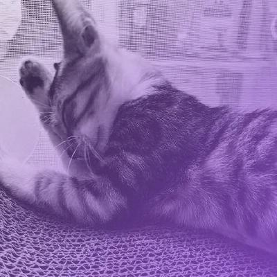

# [eliaschen - Home](https://www.eliaschen.dev)

My persional site build with Nextjs, Tailwindcss\
[https://www.eliaschen.dev](https://www.eliaschen.dev)

## Package

-   [Tailwindcss](https://tailwindcss.com/) **(Edit css with simple and faster way)**
-   [react-icon](https://react-icons.github.io/react-icons/) **(Easy way to import icons from many icons provider)**
-   [IonIcon](https://ionic.io/ionicons) **(Simple and light icons built by Ionic)**
-   [react-loading-skeleton](https://www.npmjs.com/package/react-loading-skeleton) **(Make beautiful animated loading skeletons when data still fetching)**
-   [Headless-ui](https://headlessui.com/) **(Beautifully ui components built with tailwindcss)**

## API

-   [gh-pinned-repos](https://github.com/egoist/gh-pinned-repos) **(Pinned repo of github)**
-   Github rest API **(Data of my github public repos)**

### MIT License 🔨 EliasChen
